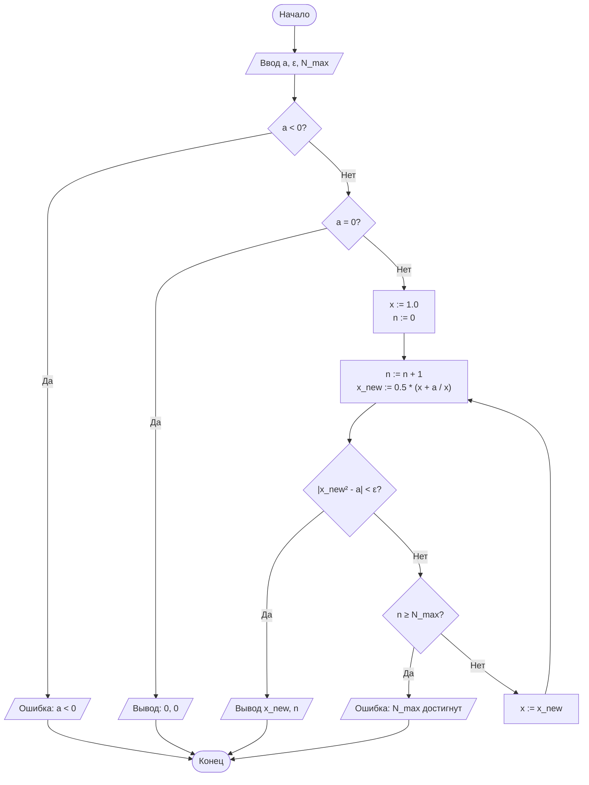
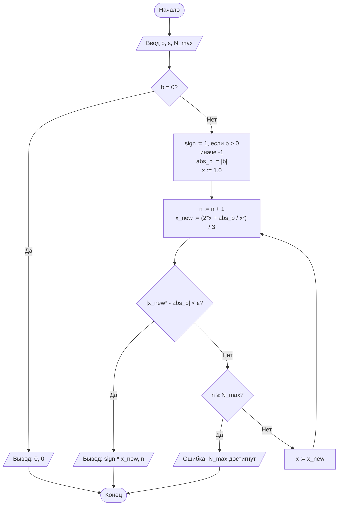
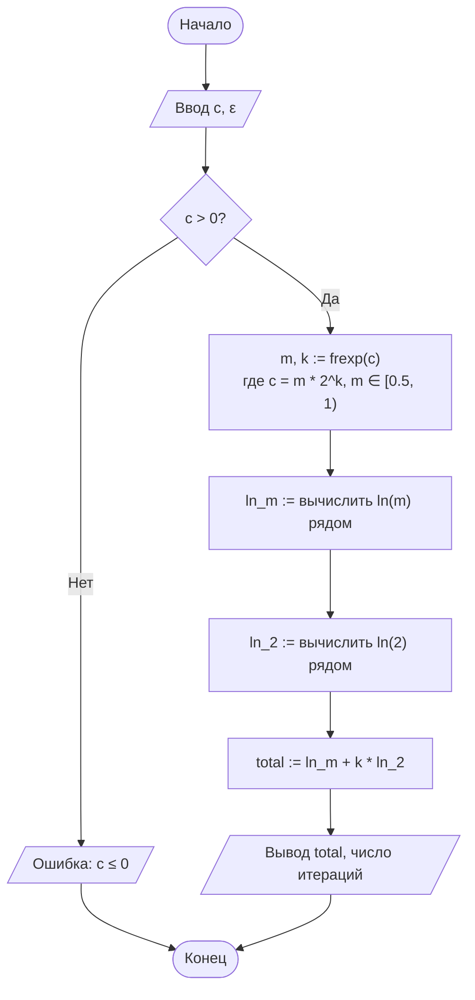

# ОТЧЁТ ПО ЛАБОРАТОРНОЙ РАБОТЕ № 1

## Титульный лист

**Дисциплина:** Теория алгоритмов

**Направление подготовки:** 38.03.05 «Бизнес-информатика»

**Курс:** 2

**Тема:** Итерационные методы вычисления элементарных функций: квадратный корень, кубический корень и натуральный логарифм

**Вариант:** 4

**Дополнительное требование:** Д3 — нормализация аргумента для вычисления логарифма

**ФИО студента:** Дымченко Игорь Владиславович

---

## 1. Цель работы и формулировка задания

### Цель работы

Изучить и применить на практике итерационные методы вычисления элементарных функций, сравнить их эффективность, а также проанализировать влияние нормализации аргумента на скорость сходимости.

### Задание варианта 4

Вычислить с заданной точностью $\varepsilon = 10^{-4}$ следующие величины:

1. $\sqrt{a}$, где $a = 0{,}25$;
2. $\sqrt[3]{b}$, где $b = 15$;
3. $\ln c$, где $c = 10$;
4. Выполнить дополнительное требование Д3: вычислить $\ln c$ с нормализацией аргумента по формуле $c = m \cdot 2^k$, где $m \in [0.5, 1)$, и сравнить число итераций с обычным вариантом.

Для всех вычислений использовать начальное приближение $x_0 = 1$ и критерий остановки по невязке.

---

## 2. Краткие теоретические сведения

### 2.1. Метод Ньютона для вычисления квадратного корня

Для вычисления $\sqrt{a}$ решается уравнение

$$
F(x) = x^2 - a = 0.
$$

Метод Ньютона для этого уравнения имеет вид:

$$
x_{n+1} = \frac{1}{2}\left(x_n + \frac{a}{x_n}\right).
$$

Критерий остановки:

$$
|x_{n+1}^2 - a| < \varepsilon.
$$

Данный метод имеет квадратичную скорость сходимости, то есть погрешность на следующем шаге примерно пропорциональна квадрату предыдущей погрешности.

### 2.2. Метод Ньютона для вычисления кубического корня

Для вычисления $\sqrt[3]{b}$ решается уравнение

$$
F(x) = x^3 - b = 0.
$$

Формула метода Ньютона:

$$
x_{n+1} = \frac{1}{3}\left(2x_n + \frac{b}{x_n^2}\right).
$$

Критерий остановки:

$$
|x_{n+1}^3 - b| < \varepsilon.
$$

Для отрицательных значений аргумента знак сохраняется отдельно, а вычисления выполняются для модуля числа.

### 2.3. Вычисление натурального логарифма через степенной ряд

Для логарифма используется представление

$$
\ln c = 2\left(y + \frac{y^3}{3} + \frac{y^5}{5} + \dots\right),
\quad y = \frac{c - 1}{c + 1}.
$$

Это эквивалентно ряду:

$$
\ln c = 2\sum_{k=0}^{\infty}\frac{y^{2k+1}}{2k+1}, \quad |y| < 1.
$$

Критерий остановки применяется по модулю очередного члена ряда:

$$
|t_k| < \varepsilon.
$$

Поскольку при $c > 1$ значение $y = \frac{c-1}{c+1}$ близко к единице, сходимость может быть медленной.

### 2.4. Дополнительное требование Д3: нормализация аргумента логарифма

Чтобы ускорить сходимость, число $c$ представляют в виде

$$
c = m \cdot 2^k,
\quad m \in [0.5, 1).
$$

Тогда

$$
\ln c = \ln m + k \ln 2.
$$

Так как $m \in [0.5, 1)$, значение $y_m = \frac{m-1}{m+1}$ оказывается существенно ближе к нулю, чем исходное $y$, поэтому ряд для $\ln m$ сходится быстрее. Это и есть смысл дополнительного требования Д3.

---

## 3. Блок-схемы алгоритмов

### 3.1. Блок-схема вычисления $\sqrt{a}$ методом Ньютона



### 3.2. Блок-схема вычисления $\sqrt[3]{b}$ методом Ньютона



### 3.3. Блок-схема вычисления $\ln c$ с нормализацией аргумента (Д3)



---

## 4. Листинг программы

Ниже приведён листинг программы без изменения исходного кода. Он соответствует варианту 4 и содержит реализацию всех трёх функций и дополнительного требования Д3.

```python
"""
Лабораторная работа № 1. Вариант 4.
Вычисление √a, ∛b и ln(c) итерационными методами.
Дополнительное требование Д3: Нормализация аргумента логарифма.
"""

import math

# Константы варианта 4
A_VAL = 0.25
B_VAL = 15.0
C_VAL = 10.0
EPS = 1e-4
N_MAX = 1000


def sqrt_newton_residual(a: float, eps: float = EPS, n_max: int = N_MAX):
    """
    Вычисление √a методом Ньютона.
    Критерий остановки: по невязке |x^2 - a| < eps.
    Начальное приближение: x0 = 1.
    """
    if a < 0:
        raise ValueError("Подкоренное выражение должно быть неотрицательным.")
    if a == 0:
        return 0.0, 0

    x = 1.0  # Условие варианта 4: x0 = 1
    for n in range(1, n_max + 1):
        x_new = 0.5 * (x + a / x)
        # Проверка критерия невязки
        if abs(x_new**2 - a) < eps:
            return x_new, n
        x = x_new
    raise RuntimeError("Точность не достигнута за N_MAX итераций")


def cbrt_newton_residual(b: float, eps: float = EPS, n_max: int = N_MAX):
    """
    Вычисление ∛b методом Ньютона.
    Критерий остановки: по невязке |x^3 - b| < eps.
    Начальное приближение: x0 = 1.
    """
    if b == 0:
        return 0.0, 0

    sign = -1.0 if b < 0 else 1.0
    abs_b = abs(b)
    x = 1.0  # Условие варианта 4: x0 = 1

    for n in range(1, n_max + 1):
        x_new = (2.0 * x + abs_b / (x * x)) / 3.0
        # Проверка критерия невязки
        if abs(x_new**3 - abs_b) < eps:
            return sign * x_new, n
        x = x_new
    raise RuntimeError("Точность не достигнута за N_MAX итераций")


def ln_series_basic(c: float, eps: float = EPS, n_max: int = 10_000):
    """
    Вычисление ln(c) базовым методом ряда без нормализации.
    """
    if c <= 0:
        raise ValueError("Аргумент логарифма должен быть больше 0.")

    y = (c - 1.0) / (c + 1.0)
    y2 = y * y
    power = y
    total = 0.0

    for k in range(n_max):
        term = 2.0 * power / (2 * k + 1)
        if abs(term) < eps:
            return total, k
        total += term
        power *= y2

    raise RuntimeError("Точность не достигнута за N_MAX итераций")


def ln_series_normalized(c: float, eps: float = EPS):
    """
    Требование Д3: Вычисление ln(c) с нормализацией аргумента c = m * 2^k, m ∈ [0.5, 1).
    ln(c) = ln(m) + k * ln(2).
    """
    if c <= 0:
        raise ValueError("Аргумент логарифма должен быть больше 0.")

    # 1. Приведение к форме c = m * 2^k
    # frexp возвращает (m, k), где m ∈ [0.5, 1)
    m, k = math.frexp(c)

    # 2. Вычисление ln(m)
    val_m, iters_m = ln_series_basic(m, eps)

    # 3. Вычисление константы ln(2)
    val_ln2, iters_ln2 = ln_series_basic(2.0, eps)

    # Итоговый результат и суммарное число итераций
    total_ln = val_m + k * val_ln2
    total_iters = iters_m + iters_ln2

    return total_ln, total_iters


if __name__ == "__main__":
    # 1. Вычисление основных функций варианта 4
    val_sqrt, iter_sqrt = sqrt_newton_residual(A_VAL)
    val_cbrt, iter_cbrt = cbrt_newton_residual(B_VAL)
    val_ln, iter_ln_base = ln_series_basic(C_VAL)

    # 2. Выполнение требования Д3
    val_ln_norm, iter_ln_norm = ln_series_normalized(C_VAL)

    # 3. Вывод сводной таблицы результатов
    print("=" * 85)
    print(f"{'Функция':<12}{'Аргумент':>10}{'Результат':>16}{'Эталон (math)':>16}{'Погрешность':>14}{'Итерации':>10}")
    print("-" * 85)

    ref_sqrt = math.sqrt(A_VAL)
    print(f"{'sqrt(a)':<12}{A_VAL:>10.2f}{val_sqrt:>16.8f}{ref_sqrt:>16.8f}{abs(val_sqrt - ref_sqrt):>14.2e}{iter_sqrt:>10}")

    ref_cbrt = B_VAL ** (1/3)
    print(f"{'cbrt(b)':<12}{B_VAL:>10.2f}{val_cbrt:>16.8f}{ref_cbrt:>16.8f}{abs(val_cbrt - ref_cbrt):>14.2e}{iter_cbrt:>10}")

    ref_ln = math.log(C_VAL)
    print(f"{'ln(c) базовый':<12}{C_VAL:>10.2f}{val_ln:>16.8f}{ref_ln:>16.8f}{abs(val_ln - ref_ln):>14.2e}{iter_ln_base:>10}")
    print(f"{'ln(c) норм.Д3':<12}{C_VAL:>10.2f}{val_ln_norm:>16.8f}{ref_ln:>16.8f}{abs(val_ln_norm - ref_ln):>14.2e}{iter_ln_norm:>10}")
    print("=" * 85)
```

---

## 5. Результаты расчётов

### 5.1. Таблица результатов

| Функция | Аргумент | Результат | Эталон (`math`) | Абсолютная погрешность | Число итераций |
| --- | --- | ---: | ---: | ---: | ---: |
| $\sqrt{a}$ | $0{,}25$ | 0,50000000 | 0,50000000 | $0{,}00 \cdot 10^{0}$ | 4 |
| $\sqrt[3]{b}$ | $15$ | 2,46621207 | 2,46621207 | $6{,}88 \cdot 10^{-7}$ | 6 |
| $\ln c$ (без нормализации) | $10$ | 2,30253509 | 2,30258509 | $5{,}00 \cdot 10^{-5}$ | 24 |
| $\ln c$ (с нормализацией Д3) | $10$ | 2,30255375 | 2,30258509 | $3{,}13 \cdot 10^{-5}$ | 9 |

### 5.2. Анализ результатов

Из таблицы видно, что методы Ньютона для квадратного и кубического корня обеспечивают высокую точность при небольшом количестве шагов. Для $\sqrt{a}$ достаточно 4 итераций, а для $\sqrt[3]{b}$ — 6 итераций. Это объясняется квадратичной скоростью сходимости метода Ньютона.

Вычисление натурального логарифма по степенному ряду без нормализации требует 24 итерации для достижения точности $10^{-4}$. После нормализации по формуле $c = m\cdot 2^k$ число итераций уменьшается до 9, то есть примерно в 2,7 раза. Это подтверждает теоретическое утверждение: уменьшение аргумента ряда $y = \frac{c-1}{c+1}$ приводит к более быстрой сходимости.

---

## 6. Анализ результатов и выводы

1. Метод Ньютона эффективно применяется для вычисления корней, поскольку за небольшое число шагов он обеспечивает требуемую точность.
2. Критерий остановки по невязке позволяет контролировать точность результата напрямую и корректно завершать вычисления.
3. Для логарифма обычный ряд сходится медленно при $c = 10$ из-за значения $y \approx 0.818$, близкого к единице.
4. Нормализация аргумента по форме $c = m \cdot 2^k$ уменьшает $|y|$ и ускоряет вычисление логарифма.
5. В результате проведённой работы получены корректные значения функций с погрешностью, не превышающей заданную точность.

### Общий вывод

Сформулированные в задании итерационные методы позволяют вычислять корни и логарифмы с требуемой точностью. Дополнительное требование Д3 успешно выполнено: нормализация аргумента сокращает число итераций и повышает эффективность вычислений.