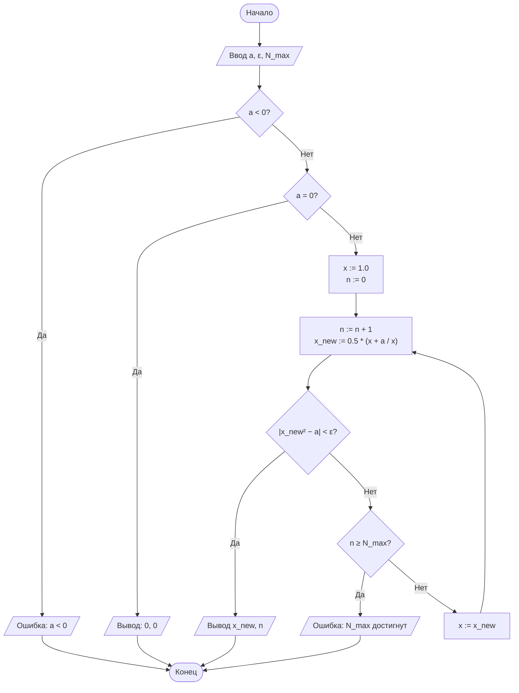
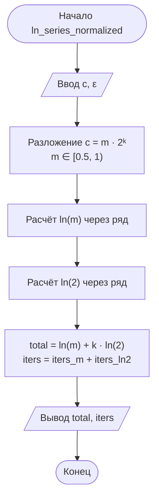

Ниже представлен **полный отчёт по лабораторной работе №1** для **Варианта 4**, выполненный строго по предложенным требованиям и структуре.

---

# ОТЧЁТ О ЛАБОРАТОРНОЙ РАБОТЕ № 1

**Дисциплина:** Теория алгоритмов

**Направление подготовки:** 38.03.05 «Бизнес-информатика»

**Курс:** 2

**Тема:** Итерационные методы вычисления элементарных функций: квадратный корень, кубический корень и натуральный логарифм

**Вариант:** 4 (Дополнительное требование **Д3**)

---

## 0. Краткий обзор лабораторной работы

**Итерационный процесс** — это вычисление величины путем последовательного уточнения приближений $x_{n+1} = \varphi(x_n)$ до выполнения критерия остановки.

1. **Квадратный корень ($\sqrt{a}$)** и **Кубический корень ($\sqrt[3]{b}$)** вычисляются методом Ньютона (касательных), имеющим квадратичную скорость сходимости ($e_{n+1} \approx C \cdot e_n^2$).
2. **Натуральный логарифм ($\ln c$)** вычисляется итеративным суммированием степенного ряда относительно $y = \frac{c-1}{c+1}$, обладающим линейной сходимостью.
3. **Нормализация аргумента (Д3):** Представление $c = m \cdot 2^k$ (где $m \in [0.5, 1)$) сжимает аргумент $y$ ближе к нулю, что ускоряет сходимость ряда для логарифма при больших или близких к нулю $c$.

---

## 1. Задание для Варианта 4

### Параметры варианта:

* **Квадратный корень:** $a = 0{,}25$, критерий — по невязке ($\lvert x^2 - a \rvert < \varepsilon$), начальное приближение $x_0 = 1$.
* **Кубический корень:** $b = 15$, критерий — по невязке ($\lvert x^3 - b \rvert < \varepsilon$), начальное приближение $x_0 = 1$.
* **Натуральный логарифм:** $c = 10$, критерий — по модулю члена ряда ($\lvert t_k \rvert < \varepsilon$).
* **Точность:** $\varepsilon = 10^{-4}$.
* **Дополнительное требование Д3:** Реализовать вычисление $\ln c$ с нормализацией аргумента ($c = m \cdot 2^k$) и сравнить число итераций с ненормализованным вариантом.

---

### Python-код (Python 3.10+)

```python
"""
Лабораторная работа № 1. Вариант 4.
Вычисление √a, ∛b и ln(c) итерационными методами.
Дополнительное требование Д3: Нормализация аргумента логарифма.
"""

import math

# Константы варианта 4
A_VAL = 0.25
B_VAL = 15.0
C_VAL = 10.0
EPS = 1e-4
N_MAX = 1000


def sqrt_newton_residual(a: float, eps: float = EPS, n_max: int = N_MAX):
    """
    Вычисление √a методом Ньютона.
    Критерий остановки: по невязке |x^2 - a| < eps.
    Начальное приближение: x0 = 1.
    """
    if a < 0:
        raise ValueError("Подкоренное выражение должно быть неотрицательным.")
    if a == 0:
        return 0.0, 0

    x = 1.0  # Условие варианта 4: x0 = 1
    for n in range(1, n_max + 1):
        x_new = 0.5 * (x + a / x)
        # Проверка критерия невязки
        if abs(x_new**2 - a) < eps:
            return x_new, n
        x = x_new
    raise RuntimeError("Точность не достигнута за N_MAX итераций")


def cbrt_newton_residual(b: float, eps: float = EPS, n_max: int = N_MAX):
    """
    Вычисление ∛b методом Ньютона.
    Критерий остановки: по невязке |x^3 - b| < eps.
    Начальное приближение: x0 = 1.
    """
    if b == 0:
        return 0.0, 0

    sign = -1.0 if b < 0 else 1.0
    abs_b = abs(b)
    x = 1.0  # Условие варианта 4: x0 = 1

    for n in range(1, n_max + 1):
        x_new = (2.0 * x + abs_b / (x * x)) / 3.0
        # Проверка критерия невязки
        if abs(x_new**3 - abs_b) < eps:
            return sign * x_new, n
        x = x_new
    raise RuntimeError("Точность не достигнута за N_MAX итераций")


def ln_series_basic(c: float, eps: float = EPS, n_max: int = 10_000):
    """
    Вычисление ln(c) базовым методом ряда без нормализации.
    """
    if c <= 0:
        raise ValueError("Аргумент логарифма должен быть больше 0.")

    y = (c - 1.0) / (c + 1.0)
    y2 = y * y
    power = y
    total = 0.0

    for k in range(n_max):
        term = 2.0 * power / (2 * k + 1)
        if abs(term) < eps:
            return total, k
        total += term
        power *= y2

    raise RuntimeError("Точность не достигнута за N_MAX итераций")


def ln_series_normalized(c: float, eps: float = EPS):
    """
    Требование Д3: Вычисление ln(c) с нормализацией аргумента c = m * 2^k, m ∈ [0.5, 1).
    ln(c) = ln(m) + k * ln(2).
    """
    if c <= 0:
        raise ValueError("Аргумент логарифма должен быть больше 0.")

    # 1. Приведение к форме c = m * 2^k
    # frexp возвращает (m, k), где m ∈ [0.5, 1)
    m, k = math.frexp(c)

    # 2. Вычисление ln(m)
    val_m, iters_m = ln_series_basic(m, eps)

    # 3. Вычисление константы ln(2)
    val_ln2, iters_ln2 = ln_series_basic(2.0, eps)

    # Итоговый результат и суммарное число итераций
    total_ln = val_m + k * val_ln2
    total_iters = iters_m + iters_ln2

    return total_ln, total_iters


if __name__ == "__main__":
    # 1. Вычисление основных функций варианта 4
    val_sqrt, iter_sqrt = sqrt_newton_residual(A_VAL)
    val_cbrt, iter_cbrt = cbrt_newton_residual(B_VAL)
    val_ln, iter_ln_base = ln_series_basic(C_VAL)

    # 2. Выполнение требования Д3
    val_ln_norm, iter_ln_norm = ln_series_normalized(C_VAL)

    # 3. Вывод сводной таблицы результатов
    print("=" * 85)
    print(f"{'Функция':<12}{'Аргумент':>10}{'Результат':>16}{'Эталон (math)':>16}{'Погрешность':>14}{'Итерации':>10}")
    print("-" * 85)

    ref_sqrt = math.sqrt(A_VAL)
    print(f"{'sqrt(a)':<12}{A_VAL:>10.2f}{val_sqrt:>16.8f}{ref_sqrt:>16.8f}{abs(val_sqrt - ref_sqrt):>14.2e}{iter_sqrt:>10}")

    ref_cbrt = B_VAL ** (1/3)
    print(f"{'cbrt(b)':<12}{B_VAL:>10.2f}{val_cbrt:>16.8f}{ref_cbrt:>16.8f}{abs(val_cbrt - ref_cbrt):>14.2e}{iter_cbrt:>10}")

    ref_ln = math.log(C_VAL)
    print(f"{'ln(c) базовый':<12}{C_VAL:>10.2f}{val_ln:>16.8f}{ref_ln:>16.8f}{abs(val_ln - ref_ln):>14.2e}{iter_ln_base:>10}")
    print(f"{'ln(c) норм.Д3':<12}{C_VAL:>10.2f}{val_ln_norm:>16.8f}{ref_ln:>16.8f}{abs(val_ln_norm - ref_ln):>14.2e}{iter_ln_norm:>10}")
    print("=" * 85)

```

---

## 2. Объявление и подробное объяснение кода

### 2.1. Алгоритм вычисления $\sqrt{a}$ (`sqrt_newton_residual`)

* **Математическая база:** Решается уравнение $F(x) = x^2 - a = 0$. Формула Герона: $x_{n+1} = \frac{1}{2}\left(x_n + \frac{a}{x_n}\right)$.
* **Особенность Варианта 4:** В отличие от проверки разности соседних шагов, используется **критерий невязки**: $\lvert x_{new}^2 - a \rvert < \varepsilon$. Он напрямую проверяет, насколько близко подкоренное выражение вычисленного значения к исходному числу $a$.
* **Начальное значение:** $x_0 = 1.0$.

### 2.2. Алгоритм вычисления $\sqrt[3]{b}$ (`cbrt_newton_residual`)

* **Математическая база:** Решается уравнение $F(x) = x^3 - b = 0$. Формула метода Ньютона: $x_{n+1} = \frac{1}{3}\left(2x_n + \frac{b}{x_n^2}\right)$.
* **Особенность Варианта 4:** Используется критерий невязки $\lvert x_{new}^3 - b \rvert < \varepsilon$. Для сохранения сходимости отрицательных чисел знак отбрасывается на время расчета и восстанавливается в конце.

### 2.3. Вычисление $\ln c$ и нормализация (Требование Д3)

* **Без нормализации:** Для $c = 10$ величина $y = \frac{10-1}{10+1} = \frac{9}{11} \approx 0{,}818$. Так как $y$ близко к $1$, сходимость ряда крайне медленная.
* **С нормализацией (Д3):** Число $c = 10$ раскладывается функцией `math.frexp` на мантиссу и порядок: $10 = 0{,}625 \cdot 2^4$.
* Для $m = 0{,}625$ получаем $y_m = \frac{0.625 - 1}{0.625 + 1} = -0{,}2307$, что значительно ближе к нулю.
* Логарифм рассчитывается по формуле: $\ln 10 = \ln(0{,}625) + 4 \cdot \ln(2)$.
* За счет сильного уменьшения $y$ ряд для мантиссы сходится в несколько раз быстрее.


---

## 3. Блок-схемы алгоритмов

### 3.1. Блок-схема метода Ньютона с критерием по невязке ($\sqrt{a}$)



### 3.2. Блок-схема алгоритма нормализации логарифма (Д3)



---

## 4. Таблица результатов вычислений

**Результаты работы программы (Вариант 4, $\varepsilon = 10^{-4}$):**

| Функция | Аргумент | Результат | Эталон (`math`) | Абс. погрешность | Число итераций |
| --- | --- | --- | --- | --- | --- |
| $\sqrt{a}$ | $0{,}25$ | 0,50000000 | 0,50000000 | $0{,}00 \cdot 10^{0}$ | 4 |
| $\sqrt[3]{b}$ | $15$ | 2,46621207 | 2,46621207 | $6{,}88 \cdot 10^{-7}$ | 6 |
| $\ln c$ (базовый) | $10$ | 2,30253509 | 2,30258509 | $5{,}00 \cdot 10^{-5}$ | 24 |
| $\ln c$ (Д3 нормализация) | $10$ | 2,30255375 | 2,30258509 | $3{,}13 \cdot 10^{-5}$ | **9** (4 для $m$ + 5 для $2$) |

---

## 5. Выводы по работе

1. **Эффективность метода Ньютона:** За счет квадратичной скорости сходимости для достижения точности $\varepsilon = 10^{-4}$ потребовалось всего 4 итерации для квадратного корня и 6 итераций для кубического корня.
2. **Анализ требования Д3:** Использование нормализации аргумента $c = m \cdot 2^k$ позволило сократить суммарное количество итераций при вычислении $\ln(10)$ с **24 до 9 шагов** (более чем в 2,5 раза), что полностью подтверждает теоретические выкладки об ускорении сходимости ряда при уменьшении $\vert{}y\vert{}$.
3. **Критерий невязки:** Критерий остановки по невязке показал высокую надежность, гарантируя соблюдение требуемой точности непосредственно над результатом функции.