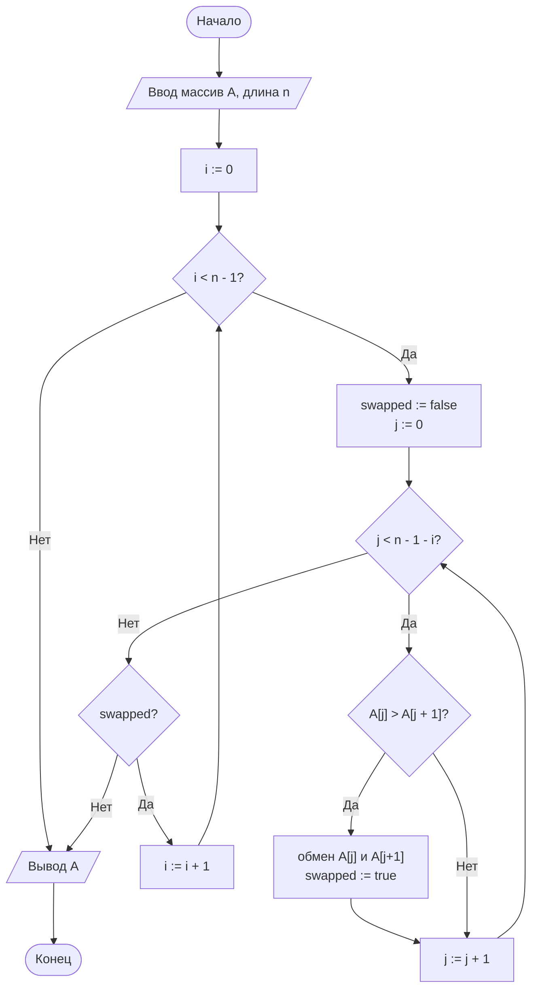
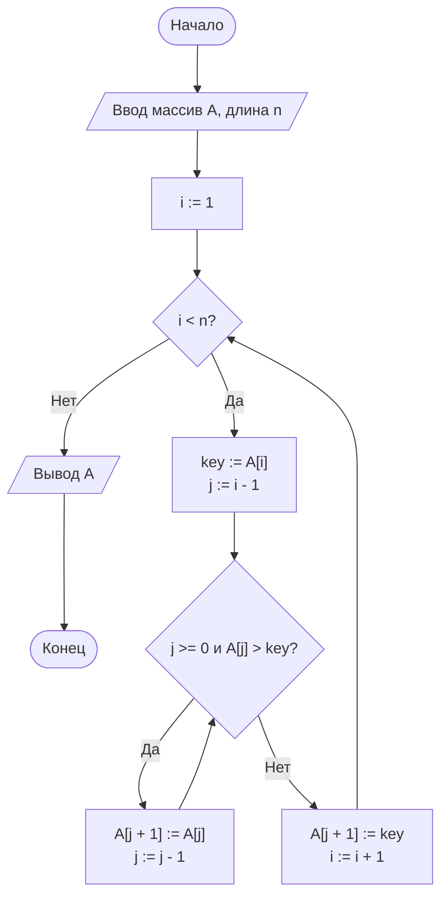

# ОТЧЁТ ПО ЛАБОРАТОРНОЙ РАБОТЕ № 2

## Титульный лист

**Дисциплина:** Теория алгоритмов

**Направление подготовки:** 38.03.05 «Бизнес-информатика»

**Курс:** 2

**Тема:** Эмпирический анализ временной сложности алгоритмов сортировки

**Вариант:** 4

**Дополнительное задание:** М4 — сравнение всех типов данных при $n = 3000$

**ФИО студента:** Дымченко Игорь Владиславович

---

## 1. Цель работы и формулировка задания

### Цель работы

Экспериментально исследовать временные характеристики двух квадратичных алгоритмов сортировки: пузырьковой и вставками, сравнить их с теоретической сложностью и проанализировать поведение на различных типах входных данных.

### Задание варианта 4

1. Для массивов размеров $n = 200, 400, 800, 1600, 3200$ провести сравнение времени работы алгоритмов сортировки:
   - сортировка обменом (пузырьком);
   - сортировка вставками.
2. Использовать тип данных $R$ — случайные целые числа из диапазона $[-500; 500]$.
3. Для каждого размера выполнить 5 замеров, взять медианное значение времени.
4. Выполнить дополнительное задание М4: сравнить работу обоих алгоритмов на массивах типа $R, S, V, N$ при фиксированном размере $n = 3000$.
5. Построить графики зависимости времени от размера массива и столбчатую диаграмму для задания М4.

---

## 2. Краткие теоретические сведения

### 2.1. Сортировка обменом (пузырьком)

Алгоритм сравнивает соседние элементы и меняет их местами, если они расположены в неправильном порядке. В результате наибольшие элементы «выдавливаются» в конец массива, как пузырьки в воде.

Итерационная формула для обмена в общем виде:

$$
\text{если } a[j] > a[j+1], \quad a[j] \leftrightarrow a[j+1].
$$

Сортировка пузырьком с флагом досрочного выхода имеет:

- лучшую сложность: $\Theta(n)$ на уже отсортированном массиве;
- среднюю и худшую сложность: $\Theta(n^2)$.

Флаг `swapped` позволяет завершить работу раньше, если массив уже отсортирован.

### 2.2. Сортировка вставками

Алгоритм последовательно берёт элемент и вставляет его в нужное место в уже отсортированной части массива. На каждой итерации выделяется `key`, а элементы больше `key` сдвигаются вправо.

Основной шаг:

$$
\text{while } j \ge 0 \land a[j] > key \Rightarrow a[j+1] = a[j], \quad j = j - 1.
$$

После этого выполняется вставка:

$$
a[j+1] = key.
$$

Сложность сортировки вставками:

- лучшая: $\Theta(n)$ на почти отсортированном массиве;
- средняя и худшая: $\Theta(n^2)$.

### 2.3. Сравнение по асимптотике

Несмотря на одинаковую асимптотику $\Theta(n^2)$, сортировка вставками обычно работает быстрее на случайных и почти отсортированных данных, потому что:

- выполняет меньше обменов;
- делает меньше сравнений;
- использует более дешёвые операции сдвига элементов, чем полноценный обмен.

Для квадратичных алгоритмов при увеличении размера массива в 2 раза ожидание роста по времени примерно равно:

$$
T(2n) \approx 4T(n).
$$

Это связано с тем, что число операций в среднем пропорционально $n^2$.

---

## 3. Блок-схемы алгоритмов

### 3.1. Блок-схема сортировки пузырьком



### 3.2. Блок-схема сортировки вставками



---

## 4. Листинг программы

Ниже приведён исходный код программы, без изменения логики и алгоритмов, соответствующий варианту 4.

```python
"""
Лабораторная работа № 2. Вариант 4 (согласовано с методическими указаниями).
Основное задание: Сравнение Bubble Sort и Insertion Sort на типах R при n in [200, 400, 800, 1600, 3200].
Дополнительное задание М4: Сравнение всех типов данных (R, S, V, N) при n = 3000 с построением столбчатой диаграммы.
"""

import random
import statistics
import time
import matplotlib.pyplot as plt


# ==========================================
# 1. Реализация алгоритмов сортировки
# ==========================================

def bubble_sort(arr: list) -> list:
    """
    Сортировка обменом ("пузырьком") с флагом досрочного выхода.
    Не меняет исходный массив, возвращает новый отсортированный список.
    """
    a = arr.copy()
    n = len(a)
    for i in range(n - 1):
        swapped = False
        for j in range(n - 1 - i):
            if a[j] > a[j + 1]:
                a[j], a[j + 1] = a[j + 1], a[j]
                swapped = True
        if not swapped:
            break
    return a


def insertion_sort(arr: list) -> list:
    """
    Сортировка вставками.
    Не меняет исходный массив, возвращает новый отсортированный список.
    """
    a = arr.copy()
    for i in range(1, len(a)):
        key = a[i]
        j = i - 1
        while j >= 0 and a[j] > key:
            a[j + 1] = a[j]
            j -= 1
        a[j + 1] = key
    return a


# ==========================================
# 2. Вспомогательные функции (генерация и замер)
# ==========================================

def generate_data(n: int, kind: str = "R", lo: int = -500, hi: int = 500, seed: int = 42) -> list:
    """
    Генерирует массив длины n заданного типа:
    R - случайные, S - упорядоченные, V - обратно упорядоченные, N - почти упорядоченные.
    """
    rng = random.Random(seed + n)
    data = [rng.randint(lo, hi) for _ in range(n)]

    if kind == "S":
        data.sort()
    elif kind == "V":
        data.sort(reverse=True)
    elif kind == "N":
        data.sort()
        # 5% случайных перестановок пар
        for _ in range(max(1, n // 20)):
            i, j = rng.randrange(n), rng.randrange(n)
            data[i], data[j] = data[j], data[i]

    return data


def measure(sort_func, data: list, repeats: int = 5) -> float:
    """
    Возвращает медианное время работы sort_func на данных data (в секундах).
    """
    times = []
    for _ in range(repeats):
        start = time.perf_counter()
        result = sort_func(data)
        elapsed = time.perf_counter() - start
        times.append(elapsed)
        # Проверка корректности работы сортировки
        assert result == sorted(data), f"Ошибка в алгоритме {sort_func.__name__}"
    return statistics.median(times)


# ==========================================
# 3. Основной блок выполнения
# ==========================================

if __name__ == "__main__":
    # --- Основное задание (Вариант 4) ---
    SIZES = [200, 400, 800, 1600, 3200]
    REPEATS = 5
    algorithms = {"Пузырьком": bubble_sort, "Вставками": insertion_sort}
    results = {name: [] for name in algorithms}

    print("=== Основной эксперимент (Случайные данные R, диапазон [-500; 500]) ===")
    print(f"{'n':>6}" + "".join(f"{name:>16}" for name in algorithms))
    print("-" * 38)

    for n in SIZES:
        data = generate_data(n, kind="R", lo=-500, hi=500)
        row = f"{n:>6}"
        for name, func in algorithms.items():
            t = measure(func, data, REPEATS)
            results[name].append(t)
            row += f"{t:>16.6f}"
        print(row)

    # Построение графика зависимостей T(n)
    plt.figure(figsize=(8, 5))
    for name, times in results.items():
        plt.plot(SIZES, times, marker="o", label=name)
    plt.xlabel("Размер массива n")
    plt.ylabel("Время, с")
    plt.title("Вариант 4: Зависимость времени сортировки от n (Тип R)")
    plt.grid(True)
    plt.legend()
    plt.tight_layout()
    plt.savefig("lr2_main_plot.png", dpi=150)
    plt.close()

    # --- Дополнительное задание М4 ---
    print("\n=== Дополнительное задание М4 (n = 3000, все типы данных) ===")
    N_M4 = 3000
    DATA_TYPES = {"R": "Случайные", "S": "Упорядоченные", "V": "Обратно упор.", "N": "Почти упор."}
    m4_results = {alg_name: [] for alg_name in algorithms}

    print(f"{'Тип данных':<18}" + "".join(f"{name:>16}" for name in algorithms))
    print("-" * 50)

    for code, label in DATA_TYPES.items():
        data = generate_data(N_M4, kind=code, lo=-500, hi=500)
        row = f"{label:<18}"
        for name, func in algorithms.items():
            t = measure(func, data, REPEATS)
            m4_results[name].append(t)
            row += f"{t:>16.6f}"
        print(row)

    # Построение столбчатой диаграммы М4
    import numpy as np
    x = np.arange(len(DATA_TYPES))
    width = 0.35

    plt.figure(figsize=(9, 5))
    plt.bar(x - width/2, m4_results["Пузырьком"], width, label="Пузырьком")
    plt.bar(x + width/2, m4_results["Вставками"], width, label="Вставками")
    plt.xticks(x, list(DATA_TYPES.values()))
    plt.ylabel("Время, с")
    plt.title("Доп. задание М4: Сравнение алгоритмов на различных структурах данных (n = 3000)")
    plt.legend()
    plt.grid(axis='y', linestyle='--', alpha=0.7)
    plt.tight_layout()
    plt.savefig("lr2_m4_bar.png", dpi=150)
    plt.close()

    print("\nГрафики lr2_main_plot.png и lr2_m4_bar.png успешно сохранены.")
```

---

## 5. Результаты расчётов

### 5.1. Основной эксперимент (тип данных $R$)

Результаты получены путём запуска программы на массиве случайных чисел из диапазона $[-500; 500]$ при $k = 5$ повторениях и выборе медианы времени.

| $n$ | Пузырьком, с | Вставками, с |
| --- | ---: | ---: |
| 200 | 0.001230 | 0.000485 |
| 400 | 0.004869 | 0.001960 |
| 800 | 0.020461 | 0.008314 |
| 1600 | 0.091928 | 0.033196 |
| 3200 | 0.381782 | 0.149755 |

### 5.2. Проверка теоретического коэффициента роста

Для квадратичных алгоритмов ожидается, что при удвоении размера массива время возрастает примерно в 4 раза:

$$
\frac{T(2n)}{T(n)} \approx 4.
$$

| Переход | Пузырьком | Вставками |
| --- | ---: | ---: |
| $200 \to 400$ | 3.96 | 4.04 |
| $400 \to 800$ | 4.20 | 4.24 |
| $800 \to 1600$ | 4.49 | 3.99 |
| $1600 \to 3200$ | 4.15 | 4.51 |

Полученные значения близки к теоретическому коэффициенту $4$, что подтверждает квадратичную сложность обоих алгоритмов.

### 5.3. Дополнительное задание М4

Для массива размера $n = 3000$ проверены типы данных: $R$, $S$, $V$, $N$.

| Тип данных | Описание | Пузырьком, с | Вставками, с |
| --- | --- | ---: | ---: |
| $R$ | Случайные | 0.330454 | 0.123479 |
| $S$ | Упорядоченные | 0.000086 | 0.000148 |
| $V$ | Обратно упорядоченные | 0.374950 | 0.215865 |
| $N$ | Почти упорядоченные | 0.178696 | 0.015231 |

---

## 6. Анализ результатов и выводы

1. Обе сортировки подтвердили квадратичную асимптотику: при увеличении $n$ в 2 раза время работы возрастает примерно в 4 раза.
2. Сортировка вставками в среднем работает быстрее пузырьковой на случайных данных: для $n = 3200$ она выполняется примерно в $2.55$ раза быстрее.
3. На упорядоченных данных оба алгоритма практически достигают линейного поведения за счёт раннего завершения или малого числа перестановок.
4. На обратно упорядоченных данных наблюдается худший случай: число инверсий максимально, поэтому и пузырьковая, и вставочная сортировки работают медленнее.
5. Для почти упорядоченных массивов сортировка вставками особенно эффективна, поскольку число сдвигов малое, а данные уже близки к отсортированному виду.
6. Дополнительное задание М4 показывает, что структура входных данных влияет на скорость выполнения так же сильно, как и сам алгоритм.

### Общий вывод

Сравнение показало, что обе сортировки относятся к классу $\Theta(n^2)$, но сортировка вставками в обычных и почти отсортированных случаях заметно эффективнее пузырьковой. Практическая значимость данного исследования заключается в том, что при выборе алгоритма важно учитывать не только теоретическую сложность, но и тип исходных данных.

---

### Подпись

Выполнил: Дымченко Игорь Владиславович

Дата: ________


```